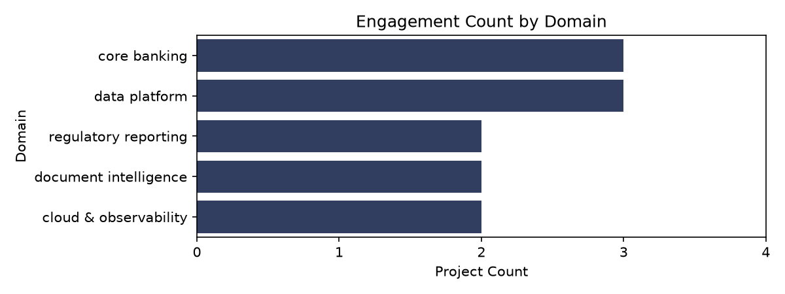
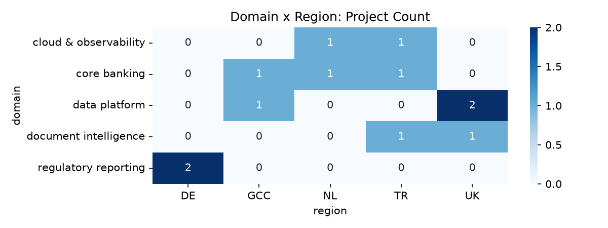
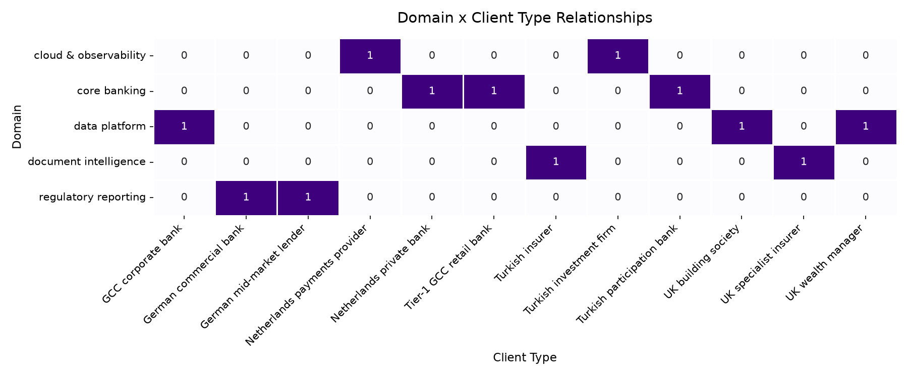
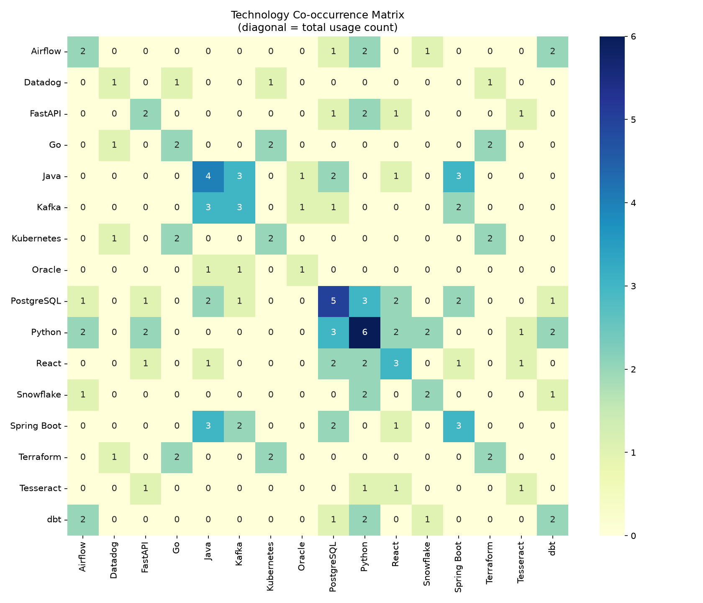
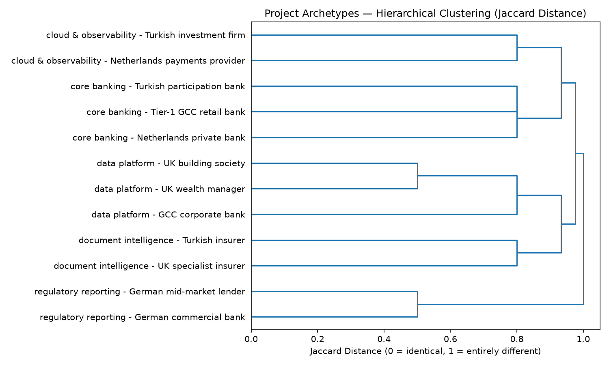

# Data Analysis & Clustering Report (L4 Project)

## Executive Summary
This report analyzes our recent 12 project wins to identify our strongest domains, regional hotspots, client profiles, and technology synergies. The insights below provide a data-driven foundation for our future sales strategies and cross-selling initiatives.

## 1. Domain and Regional Hotspots

### Domain Focus

**Key Findings:**
*   Our highest volume of work comes from **core banking** (3 projects) and **data platform** (3 projects) engagements.
*   **regulatory reporting**, **document intelligence**, and **cloud & observability** follow closely with 2 projects each.
*   *Insight:* Our company is primarily recognized as a heavy-lifter in foundational financial systems and data infrastructure.

### Regional Sweet Spots

**Key Findings:**
*   Germany (DE) is exclusively focused on **regulatory reporting** (2 projects).
*   The UK market strongly leans towards **data platform** engagements (2 projects).
*   Interestingly, **core banking** shows early signs of demand across multiple regions, though each market currently has only a single engagement.

## 2. Client Type Preferences

**Key Findings:**
*   Our client portfolio is overwhelmingly composed of financial institutions, but with strict domain matching. 
*   **Regulatory reporting** is sold specifically to German commercial banks and mid-market lenders.
*   *Opportunity:* We have established a clear niche. Sales teams should proactively target similar institutions in these specific regions using our existing successful use cases as direct references.

## 3. Technology Synergies (Co-occurrence)

**Key Findings:**
*   **Python** (6 total uses) and **PostgreSQL** (5 total uses) are the backbone of our technology stack.
*   *The Enterprise Backend Bundle:* **Java** anchors this cluster, co-occurring with both **Kafka** and **Spring Boot** 3 times each; Kafka and Spring Boot themselves co-occur 2 times.
*   *The Modern Data Bundle:* **Snowflake** is paired with **dbt** (1 time) and more strongly with **Python** (2 times).
*   *The Infrastructure Bundle:* **Kubernetes** frequently pairs with **Terraform** (2 times) and **Go** (2 times).
*   *Cross-sell Opportunity:* When a client selects Java, we should automatically propose Kafka and Spring Boot. If they need Snowflake, dbt must be positioned as a standard accompaniment.

## 4. Project Archetypes (Hierarchical Clustering)

**Key Findings:**
The dendrogram (calculated via Jaccard distance on Domain, Region, and Client
Type) confirms **5 distinct "Win Themes" (Natural Clusters)**, each mapping
directly onto one of our 5 core domains:

1. **Cloud & Observability** — Turkish investment firm + Netherlands payments provider
2. **Core Banking** — spans GCC, NL, and TR, yet clusters tightly together
3. **Data Platform** — UK-centric (building society + wealth manager), with GCC corporate bank
4. **Document Intelligence** — Turkish insurer + UK specialist insurer
5. **Regulatory Reporting** — the tightest pair, exclusively German clients

*Conclusion:* Across every domain, region and client type barely influence
clustering — domain is the dominant factor. This means our engineering and
delivery identity is defined primarily by *what* we build, not *where* or
*for whom*. This gives us confidence to pursue any of these 5 domains in
new geographies with a repeatable playbook.