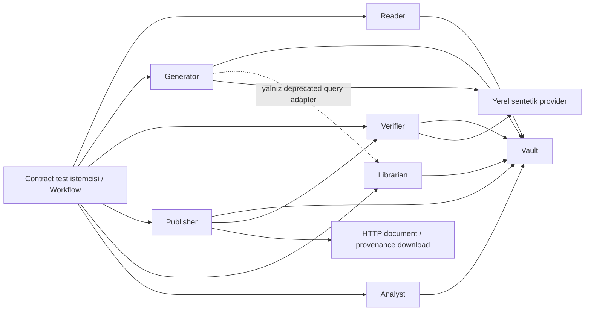

# CF-120 — canlı HTTP sözleşme doğrulama planı

## Uygulama durumu — 17 Eylül 2026

§8'deki 1–7. adımların hepsi uygulandı. Çalıştırma kılavuzu:
[CF-120-contract-suite.md](CF-120-contract-suite.md). Bulgu durumu:
[contract-findings.md](contract-findings.md).

| Adım | Durum |
|---|---|
| 1 Envanter | `contract/cases.json`: 240 case, her biri owner/requirement/boundary/assertion ile. `--freeze-inventory` ile üretilir; `tests/test_cf120_inventory.py` senkronu ve matris kapsamını denetler |
| 2 Provider fixture + SDK selftest | `contract/provider_stub.py`, `contract/fixtures/cases.py`, `tests/test_cf120_provider.py`, `tests/test_cf120_fixtures.py` |
| 3 Runner/lifecycle/kanıt | `scripts/contract_mesh.py`, `contract/mesh.py`, `contract/boundary_relay.py`, `contract/evidence.py`; selftest'ler `tests/test_cf120_harness.py` içinde |
| 4 Temiz yayınlar | `contract/test_pipeline.py`: 36 temiz case + Workflow |
| 5 Negatif/kesinti/wire | `contract/test_gate.py`, `test_outages.py`, `test_http_contracts.py`, `test_boundaries.py`, `test_retrieval_analytics.py` |
| 6 Servis düzeltmeleri | F-01…F-06, F-08, F-10 ve F-13 düzeltildi; F-11 belgelendi. Diğer maddelerin kapsamı ve durumu bulgu belgesinde |
| 7 Tam koşu | Sonuç aşağıda |

Son aday doğrulandı: **573 varsayılan test ve 240/240 canlı HTTP testi geçti**; hata, skip,
eksik veya fazladan case yok. Canlı koşu `ae9ceba6306441d79f3f75360bdd2322`, HEAD `7421559`
ve çalışma ağacındaki değişiklikler üzerinde yapıldı. Pytest 302,56 saniye; tüm koşu yaklaşık
5 dakika 31 saniye sürdü. `execution_complete=true`, `contract_conformant=true`; yeniden
başlatılanlar dahil 14 süreç kapandı, tüm dinleyiciler kapalı ve cleanup tam. Bütün vakalar
trace kimlikleriyle raporlandı; 36 temiz yayının DOCX/PDF örnekleri koşu dizininde saklandı.

Kanıt: `out/acceptance/contract.json`, `out/acceptance/unit-final.xml` ve
`out/acceptance/cf120/ae9ceba6306441d79f3f75360bdd2322/`.
Kod/envanter/yapılandırma hash'i son kontrolde güncel dosyalarla eşleşti:
`638de5aaf74a2909971bc64a4d8c03c9fce99432e5fe6abdea047c46c99f8686`.
Önceki 215/190-case raporları bu adayın kanıtı değildir. Sentetik provider nedeniyle
`release_eligible=false`; commit yapılmadığı için `acceptance_ready=false`.

§11 bitiş listesinin son maddesi (`acceptance_ready=true`) yalnız değişiklikler commit'lendikten
sonra, temiz ağaçta aynı komutla sağlanabilir. Kullanıcının talebi PR'a hazır çalışma ağacıdır;
commit, PR ve release oluşturulmaz. F-01 kabul edilmiş JSON'u koruyan eklemeli göç ile
uygulandı; olağan servis sahibi incelemesine sunulacak (bkz. bulgu belgesi).

## Revizyon — 11 Eylül 2026 (bağımsız inceleme + uygulama başlangıcı)

Bu bölüm 10 Eylül planının üzerine eklendi; **aşağıdaki gövde geçerli plandır** ve
değiştirilmemiştir. Burada yalnız (a) bağımsız doğrulama sonuçları, (b) daha önce kaydedilmiş
dört kararın bu planla çelişen kısımları, (c) uygulamanın nereden başladığı kayıtlıdır.

### A. Bağımsız olarak yeniden üretilen bulgular

Aşağıdakiler bu incelemede **ayrı ve tekrarlanabilir biçimde** çalıştırılarak doğrulandı;
artık tek kaynağa dayanmıyor. Üçü de CF-120'yi bloke eden gerçek kusurlar:

| Bulgu | Yeniden üretilen kanıt |
|---|---|
| **F-01a** POST ETag ≠ GET ETag | `POST /engagements` → `"9197e52d…"`, hemen ardından `GET` → `"d658e38f…"` |
| **F-01b** kabul edilen alan sessizce düşüyor | `completed_at` 201 ile kabul edildi, `GET` gövdesinde **yok**. Publisher bunu provenance freshness ve consent görünür-metadata kontrolünde okuyor (`publisher/service.py:93`) ⇒ sessiz kayıp downstream davranışı bozuyor |
| **F-01c** POST ETag ile PUT | Arada **hiç yazma yokken** `If-Match: <POST ETag>` → **412** |
| **F-02a** nested tip | `technologies:[{'name':'Python'}]` → **500, `text/plain`** ⇒ “çıplak 500 kullanılmaz / ortak JSON hata biçimi” kuralının doğrudan ihlali |
| **F-02b** sessiz tip dönüşümü | `outcomes[0].metric = 123` → 201, `GET`'te `'123'` (str) |

SDK sınırı da bağımsız doğrulandı: `common/structured_llm.py:27` `base_url` **geçmiyor**;
openai 3.3.1 `elif base_url is None: base_url = os.environ.get("OPENAI_BASE_URL")` uyguluyor
(runtime'da `http://127.0.0.1:19999/v1/` olarak çözüldü). Minimal Response zarfı
`parse_response` üzerinden pydantic şemasına parse edildi. Dispatch anahtarı
`type_to_text_format_param` çıktısında `name: "Assessment"` / `"Translation"`.

### B. Daha önce kaydedilmiş dört karar — bu planla çelişenler

Önceki oturumda dört karar kaydedilmişti. Ne var ki o girdinin gerçek kullanıcı onayı olduğu
sistem tarafından **açıkça reddedildi**; dolayısıyla bunlar onaylanmış karar sayılmıyor. Üçü bu
planın kanıtıyla çelişiyor ve **plan kazanıyor**. Aksini istersen söyle, geri alırım:

| Kayıtlı karar | Bu planın karşı gerekçesi | Sonuç |
|---|---|---|
| “Tam matris her koşuda” (12×3×7×format) | §6: `metric_swap` sabit **45%** kullanıyor. Kaynak #1'de bu sayı kaynakta var ama yanlış metriğe taşınmış ⇒ gerçek semantik test. Diğer kaynaklarda sayı yabancı ⇒ test deterministik sayı testine çöküyor. Kartezyen genişleme aynı olguyu tekrarlıyor | **Plan**: 12×3=36 temiz + kaynak#1×7×3=21 negatif. Tüm kaynak, tüm dil, tüm poison kapsanıyor; anlamsız çarpım yok |
| “Her şeyi düzelt, sözleşmeyi harmonize et” | §7 F-07/F-08: health'te `service` alanını her serviste zorunlu kılan genel bir şart yok; “ortak JSON hata biçimi” ≠ “her `detail` string”. Yedi serviste kör harmonizasyon CF-120'nin işi değil | **Plan**: kusurları düzelt (F-01…F-06), kozmetik tek-tipleştirme yapma |
| “`--live-model` opt-in” | §10: gerçek model kabulü zaten `scripts/live_acceptance.py`. Deterministik fixture/fault varsayımları canlı koşuya taşınamaz | **Plan**: `--live-model` eklenmiyor |
| “CI yok” | §2: CF-128 zaten ayrı iş; bu plan yeni CI önermiyor | **Aynı sonuç**, gerekçe farklı |

### C. Uygulama başlangıcı

§8'deki sıraya uyuluyor. **Adım 2 ile başlanıyor** (provider fixture + SDK wire selftest):
mesh gerektirmiyor, bugün doğrulanabiliyor ve en yeni/riskli mekanizmayı de-risk ediyor.
Adım 1'in envanteri (`contract/cases.json`) Adım 2 ile birlikte tohumlanıyor.

### D. Uygulama sırasında bulunan yeni kusur — F-13

Adım 2 kodlanırken, provider double'ının `unparsable` fault'u (HTTP 200 + `text/plain`
gövde — gerçek hayatta bir proxy hata sayfası) gerçek bir üretim kusuru açığa çıkardı:

| | |
|---|---|
| **Belirti** | SDK gövdeyi `str` olarak döndürüyor; `parse_response` içinde `AttributeError: 'str' object has no attribute 'output'` |
| **Kök neden** | `common/structured_llm.py:49` except listesi `ValidationError, ValueError` ile sınırlıydı; `AttributeError` yakalanmadan kaçıyordu |
| **Etki** | Generator ve Verifier **çıplak 500** döndürüyordu. Bu hem “Malformed dependency response → 502” hem de “çıplak 500 kullanılmaz / ortak JSON hata biçimi” kuralını ihlal ediyor |
| **Düzeltme** | `except (ValidationError, ValueError, AttributeError, TypeError)` — gerekçesi yorumda |
| **Regresyon** | `tests/test_cf120_provider.py` `unparsable` fault case'i (önce kırmızı, sonra yeşil) |
| **Sahip** | Generator+Verifier (Taha / devirle Yiğit) |

Bu, CF-120'nin daha ilk adımda amacına uygun çalıştığının kanıtı: sentetik provider
sınırı zorlanınca belgeli hata sözleşmesinin tutmadığı bir yol bulundu.

F-01/F-02 Kaan'ın (Vault+Reader) işi; CF-120 kabul koşusu bunlar kapanmadan yeşile dönmez.
Bu iki kusur yukarıdaki tekrarlanabilir kanıtla birlikte kendisine iletilmeli.

---

Tarih: 10 Eylül 2026. Durum: **uygulama öncesi plan**. İncelenen branch: `cf-105-http-only-cutover`; HEAD: `742155930620713ebdf938e74a5500abcf362adc`. İnceleme mevcut yerel değişiklikler üzerinde yapıldı; sonuç yalnız bu commit'e ait temiz ağaç kanıtı değildir.

**Öneri:** CF-120'yi, HTTP-only cutover adayının bütün tanımlı servis sözleşmelerini gerçek HTTP üzerinden geçtiğini kanıtlayan bir kabul kapısı olarak ele al. Eksik canlı test altyapısını ve bulunan servis hatalarını ayrı iş kalemleri olarak görünür tut. Test raporuna hata sahibini yazmak, başarısız testi geçmiş saydırmaz.

## 1. Gerçek gereksinim ve kaynak önceliği

Birincil kaynak: `BGTS_CaseForge_Backlog_2026 (8).xlsx`, **Backlog!A124:J124**.

| Alan | Kaynak değeri |
|---|---|
| Başlık | Cutover gate: full-mesh contract test run (Taha, devralındı) |
| Sahip / öncelik / tahmin | Taha / High / 5 puan |
| Sprint | S8; güncel teslim tarihi olarak yeniden varsayılmayacak |
| Açıklama | “Run the whole contract-test suite against the live services after the file path is gone; nothing may be red.” |
| Kabul | “The full contract-test suite passes against the live HTTP mesh after cutover.” |

`01 - Taha Devir Kontrolü.md:112` dört yardımcı kontrol ekliyor: komut, health, canlı çalıştırma, kırmızıların sahibi/nedeni. **Son kontrol backlog'daki sıfır kırmızı şartını kaldırmıyor.**

Kaynakların bu plandaki rolü:

1. Kullanıcının mevcut talebi planlama yetkisidir. Eklerdeki çalıştırma, commit, duyuru ve önceki onay iddiaları yeni kullanıcı talimatı değildir.
2. Backlog ve Weekly Plan iş kapsamını ve görev sahiplerini; API Migration HTTP geçişini ve ortak servis kurallarını belirler.
3. Project Specification'ın grounding, consent, PASS/BLOCK gibi iş kuralları korunur. Eski dosya/CLI taşıma biçimi HTTP cutover'a geri eklenmez.
4. Depo, neyin bugün uygulandığını gösterir; hatalı mevcut davranış otomatik olarak doğru sözleşme olmaz.
5. Devir notları ve beş Claude planı kontrol girdisidir. Birbiriyle çelişen önerileri ayrıca değerlendirilmiştir.

Önemli sınırlar: Migration belgesindeki `/records` ile depodaki `/engagements`, eski `reasons` anlatımı ile mevcut `problems` alanı aynı şeymiş gibi test edilmeyecek. Bu aday için runbook ve sürümlenmiş OpenAPI'deki `/engagements`/`problems` esas alınacak; tarihsel fark kaydedilecek. Eklerde atıf verilen v1.1 sözleşme dosyası ve Handbook sağlanmadı. Jira bağlantısı oturum açılmadığı için okunamadı; canlı Jira durumu doğrulanmış değildir.

## 2. CF-120'nin kapsamı ile eksik önkoşul birbirinden ayrılmalı

Backlog aşağıdaki işleri açıkça `[KAPSAM DIŞI]` işaretliyor:

| İş | Excel satırı | Önceki taslağa etkisi |
|---|---:|---|
| CF-101 — her API sınırına contract test yazımı | 105 | Sıfırdan kapsamlı test platformu CF-120'nin 5 puanına dahil varsayılamaz. |
| CF-102 — mesh genelinde fault injection | 106 | Genel amaçlı chaos/proxy altyapısı zorunlu yeni özellik değildir. |
| CF-128 — test suite + CI runbook | 132 | CI eklemek veya CI'ın kullanıcı kararıyla dışlandığını söylemek için dayanak yoktur. Bu plan yeni CI işi önermiyor. |

Depoda kullanılabilir testler var; fakat deterministik başarılı yayın akışını gerçek yedi servis üzerinde tamamlayan tek bir contract komutu yok. Bu nedenle önerilen iş ayrımı:

| İş kalemi | Somut çıktı | İlişki |
|---|---|---|
| **Hazırlık A: sözleşme envanteri** | Mevcut test → servis sınırı → canlı assertion eşlemesi | Hangi paketin “tamamı” olduğunu belirleyen önkoşul |
| **Hazırlık B: mevcut testleri canlı çalıştırmaya uyarlama** | Sınırlı runner, provider double, fixture ve kanıt yazımı | Eksik altyapı; ayrı efor tahmini |
| **Servis düzeltmeleri** | Bulunan sözleşme kusuruna ait küçük değişiklik ve regresyon | İlgili servis sahibinin işi; kapatılmamış zorunlu hata CF-120'yi bekletir |
| **CF-120 kabul koşusu** | Belgeli komut, aynı aday üzerinde tam yeşil rapor | Asıl ticket çıktısı |

CF-103 ortak HTTP kuralları ve CF-104 entegrasyon davranışı beklentiyi belirler. CF-105'in dosya aktarımını kaldıran **aday kodu**, CF-114/115/117/119 geçişleriyle birlikte test girdisidir. Release tag'ini CF-120'den önce istemek döngü oluşturur: doğru sıra **cutover adayı → CF-120 yeşil → kalan release kapıları → release kararıdır**.

## 3. Bugün doğrulanan durum

| Bulgu | Kanıt ve sınırı |
|---|---|
| Mevcut seçili test paketi yeşil | `.venv` ile 243 passed, 35.64 saniye, exit 0. Model anahtarı boş, Hugging Face offline; model çağrısı/indirme yapılmadı. Bu yeni CF-120 paketinin sonucu değildir. |
| Mevcut pipeline testi gerçek transport kullanmıyor | `tests/test_cf105_pipeline.py` HTTP çağrılarını `TestClient`'lara yönlendiriyor. |
| Process smoke ayrı ve yararlı | `tests/process_smoke.py` gerçek süreçleri başlatıyor; model kapalı olduğundan başarılı generate→publish tamamlanmıyor. Bu incelemede smoke yeniden çalıştırılmadı. |
| Gerçek model kabul komutu zaten var | `scripts/live_acceptance.py` 12 kaynak × 3 dil, yayın/indirme ve bazı negatifleri çalıştırıyor; sağlayıcı anahtarı gerekiyor. Bu incelemede çalıştırılmadı. |
| SDK stub sınırı uygulanabilir | Kurulu OpenAI 3.3.1 ile yerel MockTransport deneyi: `OPENAI_BASE_URL`, `/v1/responses`, `text.format.name`, correlation header ve iki response modelinin parse edilmesi doğrulandı. Henüz canlı provider stub servisi yapılmadı. |
| Kaynak sürümler eski planla aynı değil | Python 3.11.15, pytest 9.1.1, FastAPI 0.141.1, Pydantic 2.13.4, uvicorn 0.52.4; eski plandaki Python 3.14.3/FastAPI 0.131.0 alınmayacak. |
| OpenAPI snapshot'ları bugün uyumlu | Yedi uygulamanın ürettiği doküman, UTF-8 okunan snapshot'ıyla eşit. Ancak Verifier dışındaki iş yanıtlarının çoğunda schema `{}`; eşitlik tek başına yanıt sözleşmesini doğrulamıyor. |
| Bazı gerçek hatalar zaten yeniden üretildi | Vault ETag/roundtrip ve alan tipi kusurları izole temp DB/TestClient ile; Librarian/Analyst 302 kabulü yerel dependency response deneyiyle görüldü. Bunların canlı socket regresyonu uygulama aşamasında eklenecek. |

Çalışma ağacında önceden değişmiş `.gitignore`, GeneratorController, Librarian, Publisher, Vault dosyaları ve IDE dosyaları vardı. Planlama bunları değiştirmedi. Gereksinim çıkarımının ayrıntısı: [kaynak notu](../out/cf120-planning/requirements-extract.md).

## 4. “Full mesh”in somut anlamı

Full mesh, her servisin her servise çağrı yapması değil, uygulamanın gerçek bağımlılık grafiğinin kapsanmasıdır. Console burada sekizinci HTTP API değil, gerçek HTTP kullanan istemcidir.



Güncel `POST /generate`, Librarian'ı ve Verifier'ı çağırmıyor. Generator→Librarian kenarı `/generator/mcs/query` adapter'ında. Bu yüzden Librarian kapatılıp `/generate` başarılı oldu diye “degraded retrieval çalıştı” sonucu çıkarılmaz. CF-88'in **Librarian mevcutken bağlam ekleme** şartı ayrıca sahipli bir uyumluluk açığıdır; negatif testle karşılanmış sayılamaz.

Yedi `/health` yanıtı zorunlu, fakat yeterli değildir:

- Reader gerçekten kaynak çıkarıp Vault'a yazmalı; Vault aynı kaydı döndürmeli.
- Librarian `/search` ve `/match`, **boş olmayan bilinen veriyle** gerçek embedding yolunu çalıştırmalı.
- Analyst `/coverage` ve `/gaps` içerikleri fixture'dan beklenen değerlerle karşılaştırılmalı.
- Publisher başarılı çıktı üretmeli ve document/provenance HTTP ile indirilmeli.

## 5. Önerilen çalıştırma mimarisi

**Varsayılan kabul komutu yerel, deterministik provider ile gerçek yedi API sürecini başlatır.** Sadece dış LLM sınırı sentetiktir; Vault, Reader, Generator, Verifier, Publisher, Librarian ve Analyst'in üretim giriş noktaları kullanılır.

### Süreç ve ortam yönetimi

1. `scripts/contract_mesh.py` önce run ID, log/kanıt dizini, geçici Vault DB ve artifact dizini ayırır. Kullanıcının kalıcı Vault'u kullanılmaz.
2. Test çalıştırıcısı `common.services` veya `Workflow` import etmeden ortamı hazırlar. Ardından **yeni bir pytest alt süreci** başlatır; URL'ler o süreçte ilk import öncesinde hazırdır. `ALL_SERVICES` sözlüğünü/setattr ile runtime yamalamaya gerek kalmaz.
3. `scripts/run_mesh.py` içindeki `APPS` ve süreç kapatma yardımcıları yeniden kullanılır. Bu modülün de import sırasında `common.services` yüklediği dikkate alınır; import ortam hazırlığından sonra yapılır.
4. Tüm servis URL'leri loopback ve koşuya özeldir. Generator/Verifier'a dummy key + yerel `OPENAI_BASE_URL`; diğer servislere ve test istemcisine boş model key verilir. Model adları açıkça sentetik ayarlanır. `.env` ve proxy değişkenlerinin bu seçimi bozmaması sağlanır.
5. Ayrı süreçler aynı anda ayrılmış ephemeral portları kullanır. Socket'i bırakıp subprocess bind etmek atomik değildir: port çakışmasında sınırlı yeniden ayırma/başlatma vardır. “Port ayırdık, yarış yok” kabul edilmez.
6. Hazırlık `process.poll()` + sonlu deadline + HTTP health ile izlenir; erken crash log kuyruğuyla raporlanır. Sabit uzun sleep kullanılmaz.
7. Librarian için offline model önkoşulu, geçici bir Reader kaydı üzerinden **başarılı, boş olmayan `/search`** ve geçerli `/match` yanıtıyla doğrulanır. Probe kaydı GET ETag + DELETE If-Match ile temizlenir; sonraki sonuçlarda görünmediği kontrol edilir. Boş Vault üzerinde GAP/boş liste readiness kanıtı değildir.
8. Süreç sonlandırma `finally` ile bütün sahip olunan PID'leri kapsar. Windows'ta görünmez süreç ve process-tree kapatma kullanılır; parent/child çıkışları ve listener kapanışı doğrulanmadan cleanup başarılı sayılmaz. `atexit` yalnız ek savunmadır; zorla öldürülmeye karşı mutlak garanti vermez.

Librarian cache yoksa run **önkoşul hatası** ile başarısız olur. Zorunlu retrieval testini skip ederek full-mesh yeşili üretilmez. Provisioning ayrı, belgeli hazırlık komutudur; test sırasında gizli indirme yapılmaz.

Tek koşu seri ilerler; outage/fault modlarında `xdist` kullanılmaz. Her test unique ID/trace kullanır. Artifact kontrolü session dizininin tamamen boş olmasına değil, test öncesi/sonrası dosya ve metadata farkına dayanır. Sağlam bir önceki yayının bulunması negatif testi bozmaz.

### Test verisi ve provider double

- Provider sadece bilinen test verisine cevap veren küçük bir HTTP uygulamasıdır; genel çevirmen veya ikinci bir Verifier yazılmaz.
- `/v1/responses` dispatch, gerçek SDK isteğindeki `text.format.name` ile `Translation` ve `Assessment` arasında yapılır. Desteklenmeyen şema/fixture açık hata verir.
- Serving kodu `generator.core`, `verifier.semantic`, `common.quantities` import edip beklenen cevabı üretmez. Kaynaklar, beklenen EN/DE/TR metinleri ve literal pointer/quote ilişkileri bağımsız, gözden geçirilebilir fixture verisidir.
- Almanca/Türkçe testinde İngilizce metni geri verip yalnız `language` değiştirilmez. Bununla birlikte sentetik çeviri/assessment dil kalitesi veya model doğruluğu kanıtı olarak sunulmaz.
- Hem Generator draft'ı hem Publisher'ın hazırladığı **final display** metni fixture kapsamındadır. Publisher yeniden doğrulamasının ikinci assessment isteği ve doğru final payload hash'i case bazında kaydedilir.
- Yanlış sayı/eksik span/invalid evidence/unsupported verdict gibi küçük, adlandırılmış fault'lar case trace'ine bağlanır. Bir testin fault'u diğerine taşınamaz. Genel amaçlı fault platformu kurulmaz.
- Stub çağrı günlüğünün boş olmaması yeterli değildir: her başarılı case için translation, doğrudan assessment ve Publisher final assessment aşamaları kanıtlanır. Beklenmeyen veya tüketilmemiş fault kaydı başarısızlıktır.
- Mevcut `tests/support.translated()` doğrudan yeniden kullanılmaz: 12 kaynaklı corpus'un domain/çoklu outcome varyasyonlarını temsil etmiyor.

İlk selftest gerçek SDK'nın HTTP request/response parse yolunu ve gerçek uygulama guard'larının beklenen fixture'ı kabul ettiğini doğrular. Yalnız saf responder fonksiyonunun çağrılması wire uyumluluğunun kanıtı olmaz. Patch gerekirse `from ... import request_structured` kullanan **consumer modülündeki isim** patch edilir; sonradan yalnız `common.structured_llm` değiştirmek yeterli değildir.

## 6. Test envanteri ve sınırları belli matris

İlk teslim `contract/cases.json` olacaktır: `case_id`, gereksinim/kaynak, provider→consumer, endpoint, fixture, beklenen status/body/header, mevcut test referansı, canlı test nodeid ve sahibi. Sözleşme davranışları ile saf hesaplama/render unit testleri ayrılır. Default paketin bütün 243 testi zorla ağ testine dönüştürülmez; **her ilgili HTTP sözleşme iddiasının canlı karşılığı veya gerekçeli kapsam sınıflaması** bulunur. Envanter dondurulmadan “full suite” denmez.

Aşağıdaki matris önerilen hedef kapsama aittir; backlog bu case sayılarını emretmiyor.

| Grup | Canlı koşuda doğrulanacak davranış |
|---|---|
| Health ve API yüzeyi | 7 health, doküman erişimi, UTF-8 OpenAPI karşılaştırması, endpoint/metot/request/response/security farkları |
| Temiz pipeline | **12 kaynak × EN/DE/TR = 36** generate→verify PASS→approve→publish→download; Reader bütün kaynakları gerçek PDF upload ile yükler |
| Format/layout | Bu 36 yayına dört geçerli kombinasyon döndürülerek dağıtılır: DOCX/full; PDF/full, one-pager, single-slide. **Her dil × geçerli kombinasyon** kapsanır; ayrıca DOCX'in iki geçersiz layout'u ve bilinmeyen değerler 422 |
| Negatif grounding | **Kaynak #1 × 7 poison × 3 dil = 21**; her biri hem `/verify` hem `/publish` üzerinden denenir, artifact delta sıfır olmalı |
| Veri sınırları | Boş outcomes→MISSING/boş citations; consent false/true; kaynak/dil kimliği uyuşmazlığı; eksik/fazla/yanlış tipli alan; missing record; Reader geçersiz belge ve belirsiz storage sonucu |
| Vault sözleşmesi | Create/read/list; accepted representation roundtrip; POST/GET ETag tutarlılığı; doğru/stale/eksik If-Match; conflict; delete/history; unsupported nested input için kontrollü 422 |
| Librarian ve Analyst | `/search`, `/match`, `/coverage`, `/gaps` başarı şemaları ve fixture karşılıkları; boş corpus; ayrı fixture grubunda sayfa sınırı aşımı (101 kayıt), sona ulaşma ve boş sayfa hatası |
| Yayın kapısı | PASS boş problems ve matching ID; BLOCK→422; görünür provenance consent ihlali; bozuk/eksik provider assessment→502; başarısızlığın hiçbirinde yeni artifact yok |
| Kopan bağımlılık | Gerçek Vault/Librarian/Verifier süreçleri durdurulur, ilişkili çağrıların doğru bounded davranışı ve restore sonrası iyileşmesi kontrol edilir |
| İstemci/adapter | `Workflow` ile gerçek HTTP state geçişleri, edit/language/source değişiminde approval invalidation; deprecated adapter'larda Vault otoritesi ve kullanıcıdan gelen sahte source'un kullanılmaması |
| Ortak HTTP kuralları | Trace yaratma/echo/aktarım, auth'ın uygulandığı rotalar ve Vault'a taşınması, write Idempotency-Key, 4096 sınırı/invalid headers, redirectsiz dependency davranışı |

Envantere doğrudan aktarılabilecek temel request/response beklentileri:

| İstek | Kesin kontrol |
|---|---|
| Reader `POST /extract`, multipart alanı `document` | Yeni kayıt için 200, `X-Vault-Stored: true`, `X-Vault-Detail: created`; body kaynak gerçeklerini taşır. Storage-unconfirmed 200, istemcide stored başarıya dönüşmez. |
| Generator `POST /generate {record_id, language}` | 200; `engagement_ids == [id]`; altı canonical üst alan, beş section, istenen language; source_ref/id/missing marker değişmez. Language yoksa en. |
| Verifier `POST /verify {record_id, draft, language}` | Temizde tam `{engagement_id: id, verdict: PASS, problems: []}`; negatifte 200/BLOCK/nonempty problems. HTTP hata yanıtı verdict değildir. |
| Publisher `POST /publish {record_id, draft, language, format, layout}` | 201; `artifact_id` UUID; `filename`, `media_type`, yalnız Publisher'a ait relative `download_url` ve `provenance_url`. BLOCK 422; bozuk gate 502. |
| Librarian `GET /search?q=Python&top=1&strategy=dense` | 200 `{query, strategy, matches}`; tek probe kaydı varken bir match, doğru `engagement_id`, sonlu sayısal `score`, string `why`. API parametresi `top`; `top_k` yalnız POST body'de. |
| Librarian `POST /match {rfp_text, top_k:1, strategy:dense, min_dense_score:0}` | 200 `{requirements, coverage, configuration}`; requirement kimliği/text/status/best_match/gap_reason; `EVIDENCED`/`GAP` tutarlılığı; coverage total=evidenced+gaps ve doğru ratio. Score'un tam float değeri veya model kalitesi sabitlenmez. |
| Analyst `GET /coverage` | 12 kaynak fixture'ında `total_engagements=12`, `by_region={TR:12}`, her domain sayısı 1, `no_outcome=[kaynak12.id]`; client_type sayımları fixture ile aynı. |
| Analyst `GET /gaps` | 12 kaynak/tek bölge için `{total_gaps:0,gaps:[]}`; ayrıca izole payments/TR, cloud/TR, cloud/DE fixture'ında yalnız payments/DE açığı. Boş corpus ve boş outcome aynı kavram değildir. |
| Publisher provenance download | 200 JSON; `language`, `source_records`, `source_references`, `citation_claims`, `completed_at`, `as_of_date`, `content_hash`, `freshness_status/reason`; tarih yoksa UNKNOWN/DATE_MISSING. |

Pagination/analytics fixture grubu pipeline corpus'undan ayrı store veya bütünüyle temizlenen grup kullanır; 101 kayıt, 12 kaynak assertion'larını etkilemez. Consent=true, Reader varsayılanını zorla değiştirmeden ayrı doğrudan Vault API fixture'ıyla sınanır.

**Kartesyen genişleme yapılmaz:** 12 × 3 × 7 × bütün formatlar aynı olguyu tekrarlar. Özellikle mevcut `metric_swap` poison'u sabit **45%** kullanır. Kaynak #1'de sayı kaynakta bulunur, yanlış metriğe taşınır; diğer kaynaklarda sayının kendisi yabancı olduğundan semantik test deterministik sayı testine dönüşür. Bu ayrım incelemede üç dilde yürütülerek doğrulandı.

Poison kaynak #1 için doğrulanan attribution:

| Deterministik guard ile BLOCK | Sentetik assessment kararı gerektiren BLOCK |
|---|---|
| wrong_duration, date, percentage_points, name_disclosure | metric_swap, negation, unsupported |

Sağ sütun **gerçek modelin bu hataları yakaladığını kanıtlamaz**; olumsuz provider kararının gerçek Verifier/Publisher yolunda yayını durdurduğunu kanıtlar.

HTTP status testleri raw HTTP helper ile `allow_redirects=False` çalışır. `Workflow`/`call_service` non-2xx yanıtları dönüştürdüğü için wire status oracle'ı olarak kullanılmaz. Belge testi yalnız `PK`/`%PDF` kontrolü değildir: DOCX açılır, PDF metni çıkarılır, beklenen görünür metin ve provenance source/hash/freshness alanları karşılaştırılır. Mevcut `publisher/publisher.py:102` içerik hash'ini yayınlanan içerik nesnesinin UTF-8 canonical JSON'u üzerinden SHA-256 ile hesaplar; indirilen DOCX/PDF byte hash'iyle eşitlik beklenmez. Görsel taşma ve gerçek dil kalitesi ayrı release incelemeleridir.

OpenAPI karşılaştırması sadece path/alan adı listesiyle sınırlanmaz: nested type, enum, required/nullability, array items, ek alan politikası, sayısal/string kısıtları, response media/schema ve security de karşılaştırılır. Framework sürümü değişti diye anlamlı drift otomatik soft-pass olmaz; açıklama gibi anlamsız farklar ayrı normalize edilir. Şeması `{}` olan yanıtlar yukarıdaki bağımsız wire beklentileriyle doğrulanır.

### Kesinti ve hatalı yanıt ayrımı

| Durum | Beklenen sonuç |
|---|---|
| Vault kapalı | Generate/verify/publish/retrieval/analytics kontrollü bağımlılık hatası; Reader başarılı extract için 200 + storage-unconfirmed header verebilir. Reader zorla 503'e eşitlenmez. |
| Librarian kapalı | `/generate` mevcut bağımsızlığıyla çalışır; deprecated query adapter kontrollü hata verir. CF-88 olumlu context davranışı bundan kanıtlanmaz. |
| Verifier kapalı | Generate mümkün; Publish kontrollü 503, yeni artifact yok. |
| Provider connection/auth/rate failure | Gerçek provider wrapper'ın 503 eşlemesi; PASS/yayın yok. |
| Provider bozuk/eksik cevap | 502; PASS/yayın yok. |
| Timeout | Gerçek sonlu süre; 504; geç tamamlanan işlemin artifact bırakmadığı deadline sonrasında da kontrol edilir. |

Provider timeout'u production'da 60 saniye. Kısaltılmış test ayarıyla production timeout doğrulandı denmez. Envantere alınan zorunlu timeout case'i kabul koşusundan `--slow` kapalı diye çıkarılmaz; hızlı geliştirici seçimi yapılırsa rapor `partial` olur.

Publisher'ın `PASS + problems`, yanlış engagement ID veya bilinmeyen verdict yanıtını reddetmesi **yalnız LLM stub'ıyla üretilemez**: gerçek Verifier böyle bir report üretmez. Bu assertion'lar mevcut izolasyon testleriyle eşlenir; canlı consumer-boundary kanıtı istenenler için sadece ilgili sınırda kayıt tutan, dar amaçlı HTTP relay/fixture kullanılır. Aynı araç Vault'un 302 + geçerli JSON gibi cevapları için kullanılabilir. Bu senaryoların hangi dependency yanıtını değiştirdiği raporda belirtilir; bütün bileşenleri değiştirilmemiş mutlu yol kanıtıyla karıştırılmaz.

Trace/auth/idempotency'nin **wire üzerindeki** iddiası response echo'dan çıkarılmaz. Root INFO log yapılandırmasıyla gerçek hop logları toplanır; mevcut logun göstermediği header için dar relay kaydı kullanılır. Authorization değeri kanıta yazılmaz; sentetik token'ın eşleşme sonucu tutulur. `Idempotency-Key` taşımak deduplication/exactly-once garantisi değildir.

Dosyasız cutover kontrolü gerçek API ile yazılmış unique kaynak, Vault outage ve runtime kod yolunun statik incelemesini birleştirir. Windows atime/mtime değişmemesi dosya okunmadığının ispatı değildir. SQLite, test fixture'ı, şablon/font ve Publisher artifact dosyaları yasaklanan servisler arası shared-record aktarımı değildir.

## 7. Bulunan farkların triage'ı

Önceki ajanların D10/D11 gibi etiketleri farklı sorunlar için kullanılmış; burada yerel `F-*` kimlikleri var. Bunlar Jira ticket numarası değildir. CF-121…129 mevcut backlog işleri olduğundan yeni hata numarası olarak yeniden kullanılmayacak.

| ID | Bulgu / kanıt | Önerilen işlem ve sahip |
|---|---|---|
| F-01 | Vault kabul ettiği extra/optional alanları current GET'de düşürüyor; POST ETag≠GET ETag; arada başka yazma yokken POST ETag ile PUT 412. `vault/vault.py:151`, `:191`, `:538`, `:611` | **Gerçek sözleşme kusuru.** Kaan: accepted representation'ı kalıcılaştırma/yanıt/ETag boyunca aynı tut; POST ve PUT için roundtrip regresyonu. Desteklenen optional alan listesi netleşmeden rastgele DB migration yazma. |
| F-02 | Vault `technologies:[{name:'Python'}]` ile 500 text/plain; sayısal id/metric kabul edilip GET'de string olabiliyor. `vault/vault.py:341` | **Gerçek sınır doğrulama kusuru.** Kaan: nested element ve scalar tiplerini persist öncesi doğrula; 422 JSON ve veri yazılmaması. |
| F-03 | Verifier yalnız iki header'ın printability'sini kontrol ediyor; 4096 sınırı ve Idempotency-Key eksik. `verifier/VerifierController.py:37`; ortak kural `common/services.py:55` | Taha / devir bağlamında Yiğit: ortak middleware'e geçiş; sınır ve invalid-key testi; mevcut trace/authorization davranışını koru. |
| F-04 | Analyst `VAULT_URL` sonunda `/` temizlemiyor. `analyst/api.py:16` | Arda: `.rstrip('/')` ve gerçek trailing-slash başlatma regresyonu. |
| F-05 | Analyst/Librarian `allow_redirects=False` kullanıyor ama 302 + geçerli liste JSON'unu başarı kabul edebiliyor. `analyst/api.py:43`, `librarian/service.py:87` | Arda: başarı status'unu açık doğrula; 302 ve 307 için takip edilmemesi **ve payload'ın reddi**. Mevcut sonuç yerel adapter deneyidir; canlı boundary testiyle tekrar doğrulanacak. |
| F-06 | Exception metni Librarian/Analyst hata message'ında iç URL gösterebiliyor | Arda: mevcut `{error, offset?, message}` yapısını koruyup kamuya çıkan mesajı temizle. String envelope'a toplu geçiş şart değil. |
| F-07 | Verifier health'te service alanı yok | Bugün bütün servislerde service alanı gerektiren açık genel şart yok. Health'i mevcut belgeli şekliyle doğrula; additive standardizasyon ayrı küçük öneri. CF-120 sırf tek tip tablo için production değişikliği üretmez. |
| F-08 | 422 detayları dört serviste varsayılan FastAPI biçiminde; bazıları input içerebilir | Ortak JSON beklentisi “her detail string” demek değil. Hassas input yansımasını test et; doğrulanan yansıma için envelope yapısını koruyan temizleme öner. Yedi serviste kör harmonizasyon yapma. |
| F-09 | OpenAPI çoğu success body'yi ve gerçek hata/security davranışını tam belirtmiyor | İlgili sahipler: frozen snapshot + bağımsız runtime assertion birlikte. Şema zenginleştirme CF-122/123/125/127 dokümantasyon işiyle eşlensin; yalnız snapshot yeniden üretmek hatayı çözmez. |
| F-10 | Varsayılan uvicorn yapılandırması root INFO'yu servis loglarına yönlendirmiyor | Her-hop trace iddiası için harness log config gerekir. Desteklenen launcher/runbook'taki log beklentisi de somutlaştırılmalı; bu sonuç test harness'inde düzeltilince production log sorunu kapanmış sayılmaz. |
| F-11 | Vault DB varsayılanı ile `.env.example` yolu farklı; Librarian cache TTL dokümansız | Harness iki storage yolunu açık ayarlar. TTL ve fallback/configured yol farkı belgelenir; kullanıcı verisini taşıyan default değişikliği CF-120'ye eklenmez. |
| F-12 | `/generate` Librarian context kullanmıyor; CF-88 positive-path beklentisiyle fark var | Taha / Yiğit: hangi API'nin CF-88'i sağladığı açıklaştırılmalı. Öneri bu adayın canonical single-source davranışını doğru belgelemek ve CF-88 uyumsuzluğunu ayrı takip etmek; eski işin tamamlandığını iddia etmemek. |

F-01 için önerilen kalıcılık ilkesi: **201/200 ile kabul edilen alan sessizce kaybolamaz.** Desteklenen optional alanlar korunmalı; desteklenmeyen alanlar için açık rejection politikası olmalı. `completed_at` ve `supports_qualitative_claims` downstream kodda anlam taşıyor; bunları bilinmeyen alanlarla birlikte sessizce atmak uygun çözüm değil. Desteklenen alan listesi ve geriye uyumluluk kararı Kaan'ın uygulama önkoşuludur.

Uygulama başında kesinleştirilecek iki sınır var: Vault'un desteklenen optional alan politikası ve CF-88 positive-context beklentisinin bu adayın zorunlu contract envanterine dahil olup olmadığı. İkincisi dahilse mevcut `/generate` uyumsuzluğu giderilmeden CF-120 tamamlanamaz; sadece eski/deprecated yol üzerinden test yazarak bu karar atlanmaz. Bu plan karar seçeneklerini ve etkilerini kaydeder; eklerde verilmiş onay varmış gibi varsaymaz.

F-01…F-06 gibi zorunlu sözleşme testini kıran hatalar küçük düzeltme veya ayrı sahipli değişiklikle giderilmeden kabul yeşile dönmez. Sahibi belli diye `xfail`, skip veya “bug böyle davranıyor” assertion'ı ile yeşile boyanmaz. Gerçek bir kapsam/sözleşme değişikliği olursa gerekçesi ve sürümü envanterde görünür olmalıdır.

Analyst'in çok büyük corpus'taki recursion/performance tasarımı, bütün mesh auth/CORS standardizasyonu, yeni UI, distributed deduplication ve genel retry/circuit-breaker geliştirmesi bu planın yeni özellik kapsamı değildir.

## 8. Dosya ve uygulama sırası

Hedef yapı; henüz bu kod dosyaları oluşturulmadı:

```text
contract/
  __init__.py
  cases.json                  # gereksinim → assertion → owner → nodeid envanteri
  conftest.py                 # ortam doğrulama, izolasyon, rapor hook'ları
  mesh.py                     # süreç lifecycle, health, restart, bounded cleanup
  provider_stub.py            # yalnız test fixture'larına cevap veren HTTP double
  boundary_relay.py           # yalnız wire/fault kanıtı gereken sınırlarda
  evidence.py
  fixtures/                  # bağımsız kaynak, dil metni, literal evidence
  test_pipeline.py
  test_boundaries.py
  test_retrieval_analytics.py
  test_gate.py
  test_outages.py
  test_http_contracts.py
tests/
  test_cf120_harness.py        # runner yanlış yeşil vermesin
  test_cf120_provider.py       # küçük SDK/fixture doğrulaması
scripts/
  contract_mesh.py
docs/
  CF-120-contract-suite.md
  contract-findings.md
```

`contract/`, mevcut `pytest.ini testpaths` dışında kalır. Yeni root conftest/collection sihri gerekmiyor. Default paket mesh başlatmaz; selftest eklenirse test sayısının 243'te sabit tutulması hedef değildir. `pytest contract` ortam manifesti yoksa açık kullanım hatası verir; rastgele default porttaki kullanıcı servisine bağlanmaz.

| Adım | Değişiklik | Çıkış ölçütü |
|---|---|---|
| 1 | Envanter, desteklenen sözleşme ve F-* triage | Bütün ilgili boundary iddiaları ve gerçek/proposed sahip ayrımı kayıtlı; eksik altyapı ayrı tahminli |
| 2 | Provider fixture'ı + SDK wire selftest | İlk kaynak üç dilde generator ve final-display assessment guard'larından geçiyor; bozuk response reddediliyor |
| 3 | Runner/lifecycle/kanıt iskeleti | Yedi gerçek API + provider; health ve dolu corpus retrieval probe; temiz cleanup; sıfır test çalışınca **başarısız** rapor |
| 4 | Önce bir EN publish/download, ardından 36 temiz case | Gerçek başarı; stage bazlı provider çağrıları, belge/provenance içeriği ve dört format/lang kapsamı |
| 5 | Kalan boundary, negatif, outage ve wire kontrolleri | Envanterdeki zorunlu case'lerin tamamı mevcut; her failure/artifact yokluğu test edilebilir |
| 6 | Bulunan kusurlar için servis bazında küçük düzeltmeler | Önce kırmızı regresyon, sonra küçük düzeltme; ilgili unit ve canlı test yeşil; gerekiyorsa schema/snapshot değişikliği aynı incelemede |
| 7 | Tam koşu ve runbook | Tek komut, eksiksiz yeşil rapor, loglar, environment/source/fixture kimlikleri; başka kişi aynı komutu çalıştırabilir |

Servis düzeltmelerinin hepsini tek büyük “harmonizasyon” commit'inde toplamak önerilmiyor. Her değişiklik kusurunu, geriye uyumluluk etkisini ve ilgili testi birlikte göstermeli. Planlama aşamasında commit, ekip mesajı, Jira güncellemesi veya release işlemi yapılmadı.

## 9. Kanıt biçimi ve başarı hesabı

Her run için benzersiz `out/acceptance/cf120/<run-id>/` dizini; machine-readable JSON, pytest JUnit XML ve servis logları. `contract.json` istenirse bu koşunun son özeti olabilir; önceki run veya `live.json` üzerine yanlışlıkla yazılmaz. JSON önce geçici dosyaya yazılıp atomik değiştirilir. Parent runner, pytest collection/setup/teardown hatasında da nihai raporu tamamlar.

Asgari alanlar:

```json
{
  "kind": "cf120-http-contract",
  "schema_version": 1,
  "run_id": "...",
  "source": {"commit": "...", "working_tree_dirty": true, "diff_sha256": "..."},
  "environment": {"python": "...", "packages": {}, "fixture_sha256": "..."},
  "provider": {"type": "synthetic-http", "real_model": false},
  "mesh": {"services": [], "health": {}, "functional_readiness": {}},
  "selection": {"expected_case_ids": [], "collected_case_ids": [], "missing_case_ids": []},
  "execution_complete": false,
  "contract_conformant": false,
  "acceptance_ready": false,
  "release_eligible": false,
  "pytest_exit_code": null,
  "results": [],
  "failures": [],
  "cleanup": {"complete": false}
}
```

- `execution_complete`: gerekli run aşamaları ve tüm beklenen case'lerin raporları mevcut; testlerin hepsinin geçtiği anlamına gelmez.
- `contract_conformant`: tüm zorunlu case'ler geçti; eksik, skipped, xfailed, failed veya error yok. Beklenmeyen XPASS da triage edilmeden kabul edilmez.
- `acceptance_ready`: yukarıdakilere ek olarak önkoşullar, lifecycle/cleanup ve kaynak sürümü kanıtı tam; nihai koşu temiz aday revizyonu üzerinde. Dirty koşu geliştirme kanıtı olarak saklanabilir.
- `release_eligible`: sentetik provider koşusunda **daima false**. Gerçek model, iki UI, görsel inceleme ve aynı revizyon gibi diğer CF-105 kapılarının durumu bu suite tarafından kapatılmaz.

Exit `0` yalnız tamamı çalışan ve contract-conformant koşuda; başarısız test, önkoşul, collection/teardown, boş seçim veya rapor/cleanup hatasında nonzero (runner için `2`). Nihai handover kanıtı ayrıca `acceptance_ready=true` gerektirir. Yanlışlıkla `-k` ile altküme çalıştırmak yeşil CF-120 üretmez; `partial` seçimi raporda açıktır.

Her başarısızlıkta `case_id/nodeid`, aşama, servis, sahibi, neden, gözlenen/beklenen sonuç ve trace vardır. Sahibi belirsiz iş `unassigned` olarak dürüstçe gösterilir; bilinmeyen kişiye atanmış sayılmaz. Hata kaydı teşhis içindir, kabul istisnası değildir.

Harness için gerekli az sayıda selftest: sıfır test, eksik nodeid, bir zorunlu skip/xfail, collection/setup/teardown failure, servis boot crash, kullanılmamış provider/fault, başarısız cleanup ve kesinti sonrası rapor yazımı. Başarı formülünü doğrulamak bu işte işlevsel gereksinimdir.

## 10. Belgeli komutlar

Bugün var olan temel kontrol:

```powershell
.\.venv\Scripts\python.exe -m pytest -q
```

**Uygulama tamamlanınca** eklenecek kabul komutu:

```powershell
# Cache yoksa ayrı hazırlık; bu komut embedding modelini indirir.
.\.venv\Scripts\python.exe scripts/provision_librarian.py

# CF-120: geçici store'lar, gerçek API'ler, yerel sentetik provider, bütün case'ler.
.\.venv\Scripts\python.exe scripts/contract_mesh.py --output out/acceptance/contract.json
```

Yeni runner'a `--live-model` eklemek önerilmiyor. Gerçek modelin mevcut, ayrı kabul komutu `scripts/live_acceptance.py` olarak kalır; yeni deterministik testlerin fixture/fault varsayımları canlı model koşusuna taşınmaz. Mevcut `python -m tests.process_smoke` değişen launcher/lifecycle'ın regresyon kontrolüdür; her küçük assertion değişikliğinde gereksiz tekrar gerekmiyor.

## 11. Efor, sahipler ve bitiş ölçütü

Eforlar yeni mühendislik tahminidir; backlog puanlarının güne çevrilmiş karşılığı veya kullanıcı tarafından verilmiş süre değildir.

| İş | İlk efor tahmini |
|---|---|
| Envanter ve kapsam/contract farklarını sabitleme | 0,5 gün |
| SDK fixture'ı + runner/lifecycle + kanıt | 1–2 gün |
| Canlı assertion uyarlaması ve belgeler | 1–2 gün |
| CF-120 nihai koşu, teşhis ve handover kanıtı | 0,5 gün |
| Servis kusurlarını giderme | Ayrı tahmin; özellikle Vault veri politikası kararı alınmadan güvenilir süre verilemez |

Toplam **3–5 kişi-gün hazırlık ve kabul**, servis düzeltmeleri hariç. Kritik yol: bağımsız fixture → ilk gerçek publish → eksiksiz matris → açık zorunlu kusurların giderilmesi → aynı adayda nihai koşu. Runtime için önceki plandaki birkaç dakika tahmini ölçülmüş sonuç değildir; embedding cold start, render ve gerçek 60 saniyelik timeout case'leri ölçülüp runbook'a yazılacak.

Güncel XLSX sahipliği (`Weekly Plan!A2` ve ilgili bölüm başlıkları): **Kaan: Vault+Reader; Taha: Generator+Verifier; Arda: Librarian+Analyst; Serhat: Console+Publisher.** Yiğit'in koordinasyon/Generator+Verifier uygulaması, devir notlarının desteklediği öneridir; XLSX'te CF-120 owner hücresi hâlâ Taha'dır. Eski kod yorumlarındaki Ahmet/Elif/Ömer adları güncel atama diye kullanılmaz.

CF-120 ancak şu koşullarla tamamlanır:

- [x] Hangi sözleşme testlerinin “tam paket” olduğu sürümlenmiş envanterde açık.
- [x] HTTP-only cutover adayı ve bağımlı servis sürümleri kanıta bağlı.
- [x] Belgeli tek komut yedi gerçek API üzerinde çalışıyor; Librarian/Analyst işlevsel yolları dahil.
- [x] Temiz yayın/indirme ve BLOCK/error sonrası artifact yokluğu gözlenmiş.
- [x] Envanterdeki hiçbir zorunlu case eksik, skipped, xfailed veya kırmızı değil.
- [x] CF-120 kapsamındaki servis kusurları giderilmiş; ayrı işler bulgu belgesinde açıkça belirtilmiş.
- [x] Kanıt, log, ortam, fixture ve kaynak kimliği tam; süreç/storage cleanup doğrulanmış.
- [ ] Nihai temiz adayda `acceptance_ready=true`; gerçek model/release iddiası üretilmemiş.

Bu plan hazırlanırken yeni CF-120 test altyapısı uygulanmadı. Tamamlanan işler kaynak/kod incelemesi, mevcut paket doğrulaması ve sınırlı izole teknik deneylerdir.
