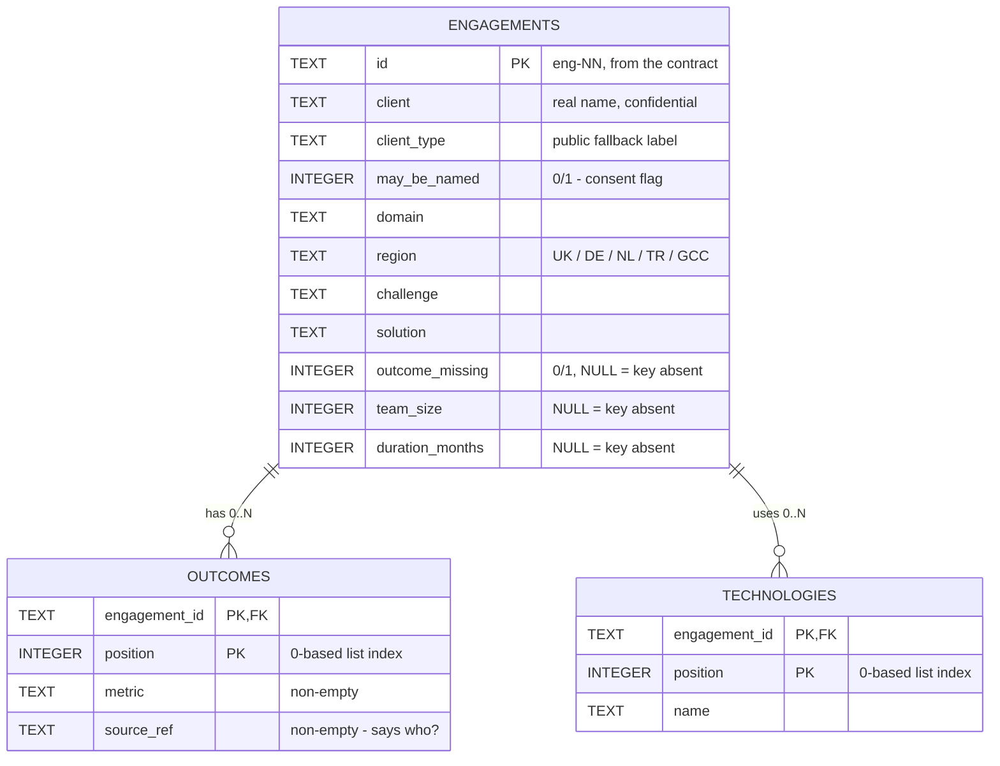

# Vault — E-R Model (L1)

Author: Kaan · Reviewer: Ömer · Status: draft for review

## The model

## Design decisions

1. **`outcomes` is a one-to-many table, not a JSON column.**
   Each outcome is a structured object (`metric` + `source_ref`) with its own
   NOT NULL rules, and downstream prototypes (Analyst, Verifier) will want to
   query outcomes individually. eng-12's *empty* list is naturally "zero rows"
   — nothing special to handle.

2. **`technologies` is also a one-to-many table.**
   Same reasoning; it makes "which engagements used Kafka?" a plain query,
   which the L3 filter and the Librarian benefit from.

3. **A `position` column preserves list order.**
   The round-trip requirement is *identical* in, identical out. SQL tables
   have no inherent row order, so we store the original list index and
   `ORDER BY position` on the way out.

4. **Booleans are INTEGER 0/1, converted back to true/false on read.**
   SQLite has no boolean type. The read path converts `may_be_named` and
   `outcome_missing` back to real booleans so eng-02's `may_be_named: true`
   survives the trip exactly.

5. **Optional keys are NULL-able columns, and NULL means "key absent".**
   `team_size`, `duration_months` (MAY fields) and `outcome_missing`
   (conditional) may be missing from a record. If the column is NULL, the
   read path *omits the key entirely* instead of emitting `"team_size": null`
   — otherwise the reloaded record would not equal the original.

6. **CHECK constraints enforce the contract at the database layer.**
   `region` must be one of the five valid values, booleans must be 0/1, and
   `metric`/`source_ref` must be non-empty (spec §3.2). Bad data fails loudly
   at insert time instead of poisoning the store.

7. **Foreign keys with `ON DELETE CASCADE`.**
   Replacing or deleting an engagement automatically removes its child rows;
   no orphaned outcomes.

## Verified against the test data

- All 12 corpus records load and read back identically.
- `eng-12` (empty `outcomes`) ? zero rows in `outcomes`, reads back as `[]`.
- `eng-02` (`may_be_named: true`) ? flag intact after reload.
